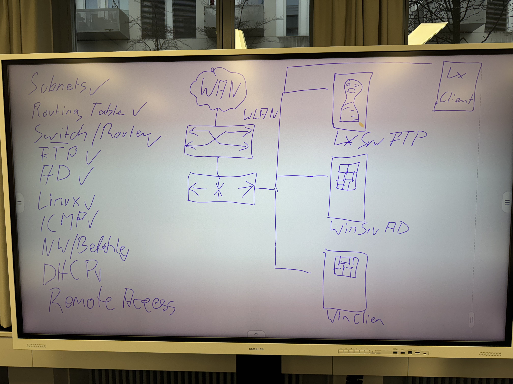

# Netsun
Wir haben ein Netzwerk für die Firma Netsun erstellt wobei wir mit einem /28 Netzwerk arbeiteten und wir
einen Windows Client, Ubuntu Client, Ubuntu Server und Windows Server hatten mit verbindung zu zwei Switches
und einem Router.

  **Auftrag:**  

  **Materialliste**  

|         Material         |   Wofür?   |
|--------------------------|:----------:|
| AiO-Desktop-PCs          |   Clients  |
| Tower-PCs                |   Server   |
|2x Netgear managed Switch | Switching  |
| Netgear Access Point     | Access Point / Router  |

  **Was haben wir gemacht:**  
Wir haben einen SSH und FTP-Server auf Ubuntu Linux erstellt und konfiguriert damit wir z.B. Daten auf den 
Linux Server laden können oder wir uns mit dem Ubuntu Client verbinden können. Wir haben auch eine Active
Directory mit OUs und Rechten in einer Domäne erstellt und haben noch den Switch und Router konfiguriert.

  **Was lief gut**  
- Active Directory konfiguration
- ISO Image brennen
- Switch & Router reseten & konfigurieren

  **Was war schwieriger**  
- Den FTP & SSH aufzustellen
- Wir hatten einen kleinen Zeitdruck
